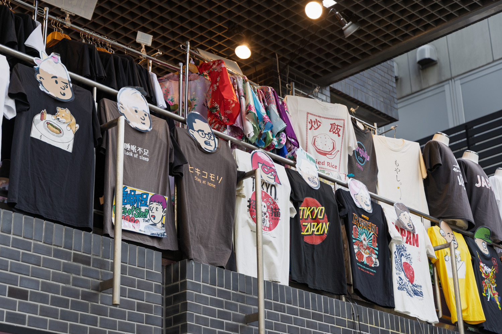
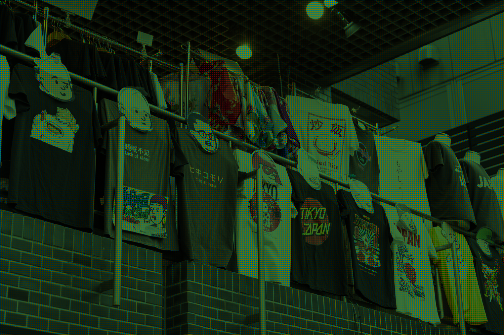
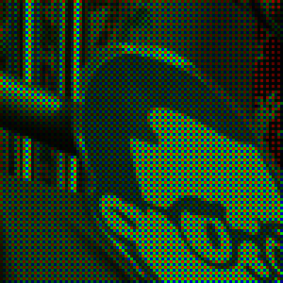
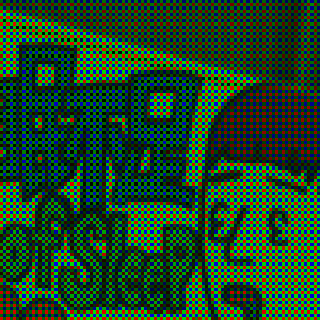
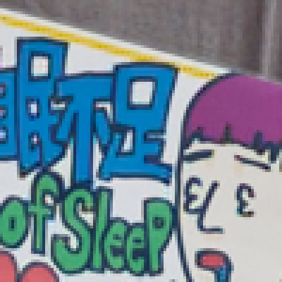
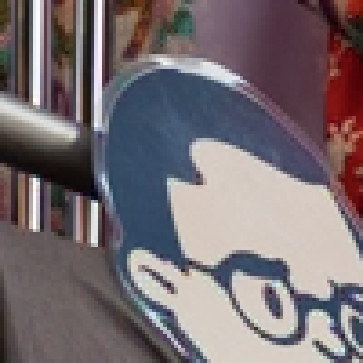

# Residual Interpolation Demosaicing

Python re-implementation of residual interpolation demosaicing algorithms from the Institute of Science Tokyo (formerly Tokyo Institute of Technology) project page, [Residual Interpolation for Color Image Demosaicking](http://www.ok.sc.e.titech.ac.jp/res/DM/RI.html).

This repository provides a Python re-implementation only. It is not the original MATLAB release and is not an official distribution from the original authors. The upstream MATLAB code and publications were released by Yusuke Monno and Daisuke Kiku.

`demosaic/` is the optimized implementation. `demosaic_reference/` is the naive MATLAB-to-Python translation kept only for comparison and regression tests; normal code should import `demosaic`.

## Usage

```python
import cv2

from demosaic import demosaic, mosaicing_cfa_bayer

img_bgr = cv2.imread("tshirts.jpg", cv2.IMREAD_COLOR)
img_cfa = mosaicing_cfa_bayer(img_bgr, "RGGB")
img_demosaiced = demosaic(img_cfa, "COLOR_BayerRGGB2BGR_ARI")
cv2.imwrite("tshirts_ari.png", img_demosaiced.astype("uint8"))
```

Codes use this form:

```python
COLOR_Bayer{PATTERN}2BGR_{ALGORITHM}
```

### Supported Algorithms

| Method | Corresponding paper |
| --- | --- |
| `RI` | Kiku et al., **"Residual Interpolation for Color Image Demosaicking,"** IEEE ICIP 2013. |
| `MLRI` | Kiku et al., **"Minimized-Laplacian Residual Interpolation for Color Image Demosaicking,"** IS&T/SPIE Electronic Imaging 2014. |
| `MLRI2` | Kiku et al., **"Beyond Color Difference: Residual Interpolation for Color Image Demosaicking,"** IEEE Transactions on Image Processing 2016. |
| `ARI` | Monno et al., **"Adaptive Residual Interpolation for Color Image Demosaicking,"** IEEE ICIP 2015. |
| `ARI2` | Monno et al., **"Adaptive Residual Interpolation for Color and Multispectral Image Demosaicking,"** Sensors 2017. |

### Supported Bayer Patterns

| Pattern | CFA Layout |
| --- | --- |
| `RGGB` | R G<br>G B |
| `GRBG` | G R<br>B G |
| `GBRG` | G B<br>R G |
| `BGGR` | B G<br>G R |

## Benchmark

The specialized benchmark compares all five algorithms in this repository with OpenCV bilinear/edge-aware demosaicing and `colour_demosaicing` Malvar2004/Menon2007. It creates one shared Bayer CFA from `tshirts.jpg`, runs every method against that same CFA.

```bash
python benchmark_tshirts.py --runs 5
```

The IMAX/Kodak benchmark uses the official Tokyo Tech RI benchmark archive linked from the upstream project page. Download and extract the expected `datasets/IMAX` and `datasets/Kodak` files before running `benchmark.py`:

```bash
python download_datasets.py
python benchmark.py --benchmark
```

Benchmark image: `tshirts.jpg` (1500 x 1000), Bayer pattern `RGGB`, 5 timed runs after one warmup. CPSNR is computed against the original RGB image with `peak=255` and no border crop. SSIM Avg is the RGB-channel average from `demosaic.ssim`.

| Method | Implementation | CPSNR (dB) | SSIM Avg | Time (s) |
| --- | --- | ---: | ---: | ---: |
| ARI2 | This repository | *38.86* | **0.9902** | 52.4578 |
| ARI | This repository | **38.88** | *0.9898* | 44.3213 |
| MLRI2 | This repository | 38.29 | 0.9892 | 0.8047 |
| MLRI | This repository | 38.04 | 0.9887 | 0.5336 |
| RI | This repository | 38.03 | 0.9885 | 0.4727 |
| Menon2007 | colour_demosaicing | 35.69 | 0.9817 | 0.2237 |
| Malvar2004 | colour_demosaicing | 34.54 | 0.9772 | 0.0759 |
| Edge-Aware | OpenCV | 30.77 | 0.9511 | 0.0002 |
| Bilinear | OpenCV | 30.57 | 0.9500 | 0.0002 |

## Input and CFA

| Input | Bayer CFA (RGB-colored) |
| --- | --- |
|  |  |

## CFA Crops

4x nearest-neighbor zoom.

| Crop Region | Original Input | RGB-colored CFA |
| --- | --- | --- |
| crop1 |  |  |
| crop2 |  |  |

## Demosaiced Crops

4x nearest-neighbor zoom.

| Method | Crop1 | Crop2 |
| :---: | :---: | :---: |
| Original |  |  |
| RI |  |  |
| MLRI |  |  |
| MLRI2 |  |  |
| ARI |  |  |
| ARI2 |  |  |
| Bilinear |  |  |
| Edge-Aware |  |  |
| Malvar2004 |  |  |
| Menon2007 |  |  |
